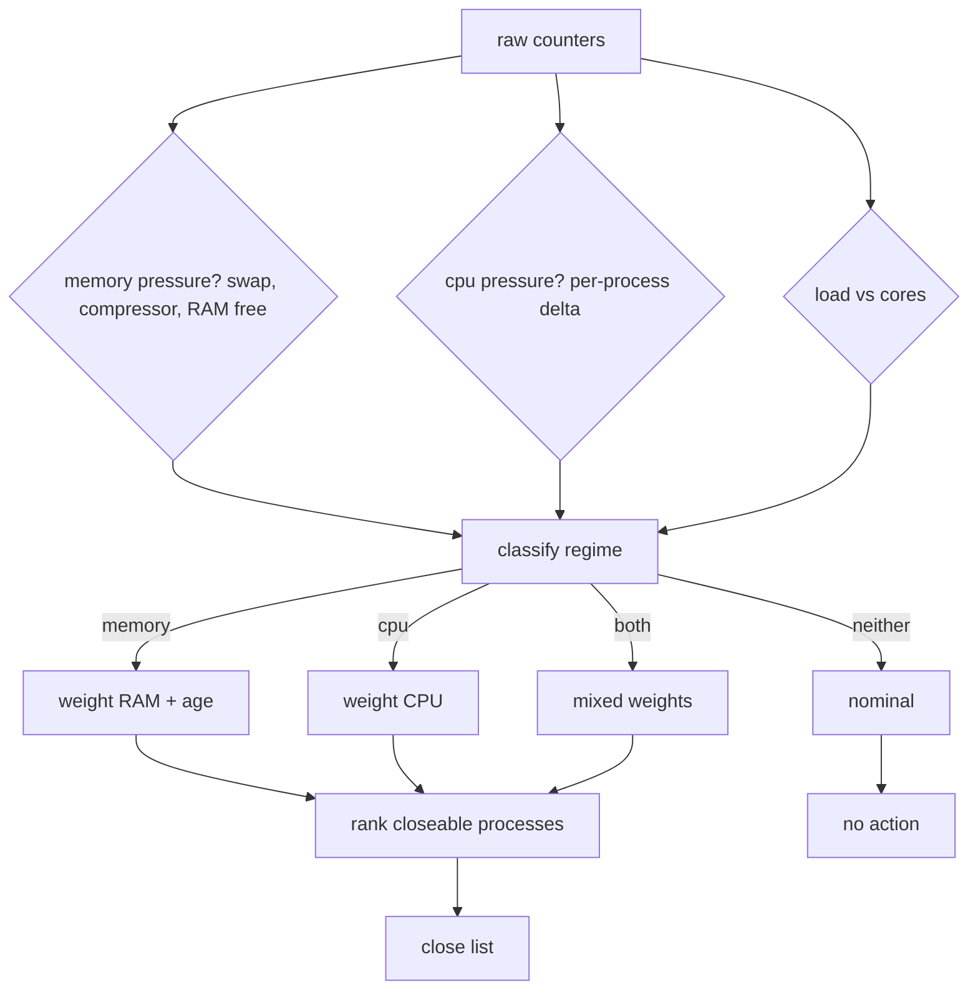

# How It Works

`fm` turns a pile of raw counters into one answer: **why is the fan spinning,
and what should I close?** This page explains the reasoning; the exact numbers
live in [The Algorithm](algorithm.md).

## The two regimes

Every hot Mac is in one of two states, and they look identical on the surface
(hot, loud, load average through the roof) but are opposite underneath:

=== "CPU regime"

    Something is genuinely **computing**. Load average is high *and* the sum of
    per-process CPU% is high. The fix: find the CPU hog and stop it (or wait it
    out).

=== "Memory regime (swap thrash)"

    The Mac has **run out of RAM** and is paging to disk. Load average is high —
    load counts tasks blocked on I/O, not just CPU — but the sum of per-process
    CPU% is *low*, because processes are stuck waiting on the disk, not running.
    The fix: free RAM by closing the biggest, longest-lived apps.

??? example "A real one"
    In one observed episode, load average hit **15 on 10 cores** while the app's
    15-second CPU-time delta measured only **0.0 CPU-seconds**. The machine
    wasn't computing at all — it was paging. Swap had grown from 14 GB to 24 GB
    in ~90 minutes. A CPU-only tool would have reported "nothing using the CPU,
    fan is fine" while the fan screamed.

## Why `ps %cpu` lies

`ps`'s `%cpu` column is a process's CPU time **averaged over its entire
lifetime**, and can be stale. A process that spiked and then blocked on I/O looks
calm. `fm` instead samples cumulative CPU time twice and computes a **delta over
the sampling window** — the true instantaneous usage. That delta is what makes
the CPU-vs-memory distinction reliable.

## Sampling pipeline

Every refresh, `engine.Engine` assembles one **snapshot** by reading:

| Source | What it gives you |
|---|---|
| `smc` (via Stats.app, optional) | fan count, RPM, target, range; all temperature sensors |
| `pmset -g therm` | CPU speed limit — how much macOS is throttling |
| Mach `host_processor_info` | per-core user / system / idle ticks (ctypes, no sudo) |
| `ps -axww` | PID, PPID, RSS, age, cumulative CPU time, full command line |
| `vm_stat` | free / wired / anonymous / file-backed pages, compressor stored vs occupied, page-in/out counters |
| `sysctl` | `vm.swapusage`, `vm.loadavg`, `hw.ncpu`, `hw.memsize`, `hw.perflevel*.logicalcpu`, `kern.boottime` |
| `memory_pressure` | system-wide RAM free % |
| `~/watchdogs/…` | fan-event log + probe status (read-only) |

CPU% and page I/O rates are **deltas** against the previous sample, so the very
first frame shows zeros and subsequent frames are real. Sampling runs in a
**background worker thread**, so the UI never blocks on subprocess I/O.

## Classification

Each process is tagged into one category, which drives both the recommendation
weight and whether it's even killable:

| Category | Examples | Killable? | Prior |
|---|---|---|---|
| `agent` | claude, codex, ChatGPT/Codex, omp, devin, cmux, sinter, node_repl | yes | 1.00 |
| `browser` | Chrome, Edge, Safari, Arc, Firefox, Brave (+ helpers) | yes | 0.85 |
| `chat` | WhatsApp, Telegram, Discord, Slack, Teams, Zoom | yes | 0.60 |
| `app` | anything else under `/Applications` | yes | 0.50 |
| `system` | WindowServer, launchd, kernel_task, mds/mdworker, suggestd, `com.apple.*`, `/usr/libexec/`, … | **never** | — |

!!! note "System processes are symptoms, not causes"
    If WindowServer is burning CPU, closing it is not the answer — it's the
    compositor rendering too many windows/displays. `fm` surfaces these as
    **advisories** ("WindowServer at 78% — reduce windows/displays") instead of
    offering a kill.

## Grouping swarm siblings

Long-running agent setups (multi-agent "swarms") spawn many processes sharing a
session id. `fm` extracts the `session-<8hex>` token from the command line and
groups same-session agents, so a recommendation like
`claude@session-476111c5 x3` collapses three siblings into **one** row and one
kill action.

## From verdict to a ranked list

Once the regime is chosen, every closeable group gets a score and the top six are
shown. Weights flip between regimes: memory thrash prioritises RAM and age; CPU
load prioritises CPU%. The exact formula, thresholds, and defaults are in
[The Algorithm](algorithm.md).
