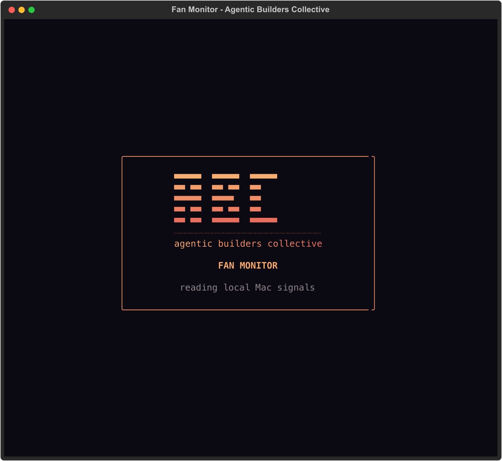
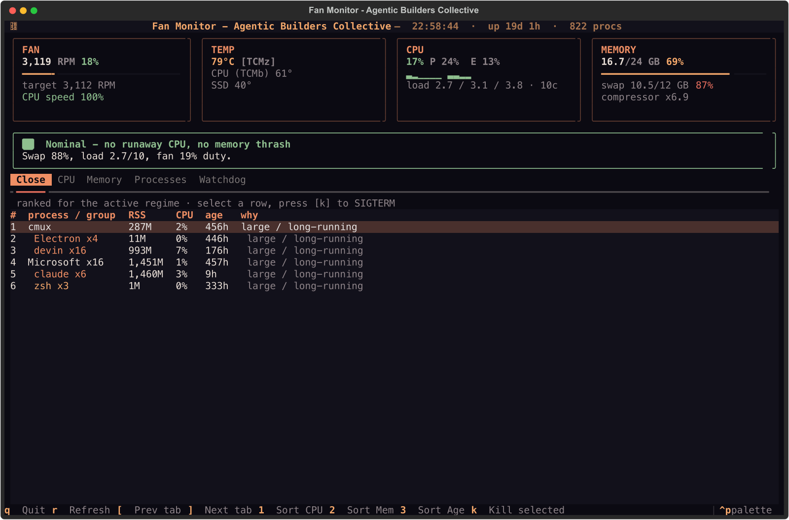
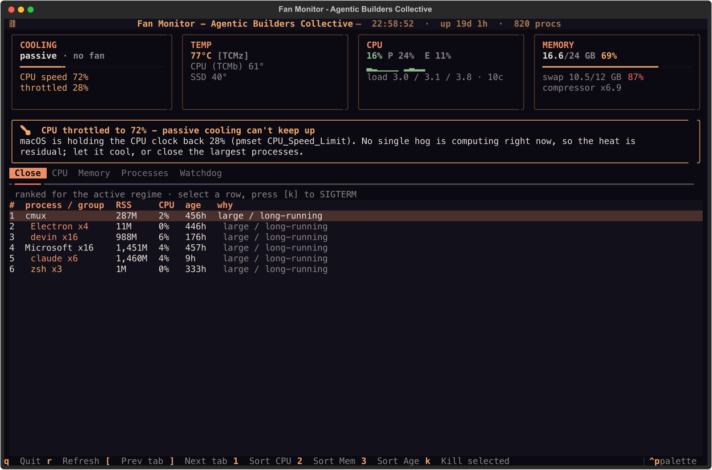

# macOS Fan Monitor

<p align="center">
  <a href="https://www.agenticbuilders.sg/"></a>
</p>

???+ tip inline "The one-line summary"

    **Why is my Mac hot — and what should I close?** A native macOS terminal
    app that answers that at a glance, on MacBook Pros *and* fanless MacBook
    Airs, without asking an LLM each time.

`fm` is a lazygit / yazi-style **Textual** TUI built for the members of the
[Agentic Builders Collective](https://www.agenticbuilders.sg/). It watches your
Mac's real signals — fan RPM or CPU throttling, temperatures, per-core CPU, RAM
breakdown, swap, and the live process list — figures out **why** the machine is
hot, ranks the processes worth closing, and lets you terminate one with a single
key. A full-screen ABC mark assembles while the first readings load, then the
persistent header identifies the app as **Fan Monitor - Agentic Builders
Collective**.





## The core idea

A hot Mac comes from **two very different causes**, and the fix for each is
different:

| Regime | Signal | What's happening | Fix |
|---|---|---|---|
| **CPU** | load high **and** CPU% high | something is genuinely computing | close / wait on the CPU hog |
| **Memory** (swap thrash) | load high **but** CPU% **low** | RAM is exhausted; processes are blocked on disk, not computing | close **memory** hogs |
| **Thermal** | neither, but macOS is throttling | residual heat the cooling can't shed yet | let it cool, close the largest processes |

The memory regime is the sneaky one — `ps %cpu` and Activity Monitor's "top CPU"
both **miss it**, because a process stuck paging shows *low* CPU. `fm` infers it
from the combination of swap pressure, the memory compressor, load, and how much
CPU is actually being used. That inference is the heart of the tool.

## MacBook Air

No fan? `fm` notices, retitles the FAN tile to **COOLING**, reads the CPU speed
limit from `pmset -g therm`, and adds a 🌡️ thermal verdict. The **CPU** and
**Memory** tabs show which cores are pinned and whether the machine is swapping.



## Get started

```bash
pipx install macos-fanmon
fm
```

See [Getting Started](getting-started.md) for the full walkthrough, and
[User Guide](user-guide.md) for every screen and key.

## Jump to

- [:material-rocket-launch: Getting Started](getting-started.md) — install & first run
- [:material-account-eye: User Guide](user-guide.md) — tiles, tabs, keys, killing
- [:material-brain: How It Works](how-it-works.md) — the diagnosis logic
- [:material-calculator: The Algorithm](algorithm.md) — scoring & thresholds (exact)
- [:material-shield-check: Watchdog Integration](watchdog.md) — correlate with your own watchdog
- [:material-wrench: Troubleshooting](troubleshooting.md) — common issues, Air notes
- [:material-map: Roadmap](roadmap.md) — what's next
- [:material-language-markdown: Contributing](contributing.md) — dev setup & tests

## Safety model

- **Read-only by default.** `fm` reads the SMC, `pmset`, Mach CPU counters,
  `ps`, `vm_stat`, and your watchdog logs. It never writes to hardware.
- **Nothing dies unless you say so.** The `k` key shows a confirmation prompt and
  re-checks each PID is still alive before sending `SIGTERM`. It is never
  automatic.
- **System daemons are never killable.** WindowServer, Spotlight, `suggestd`, and
  friends are *symptoms*, not causes — the tool explains them instead of offering
  to kill them.

## About ABC

The [Agentic Builders Collective](https://www.agenticbuilders.sg/) is a
Singapore-based community of 1,000+ people building agentic software. `fm` is
community software: it wears ABC's wordmark and colours, and the peach → coral
gradient from the logo is the heat scale on every gauge.

## License

MIT — see [LICENSE](https://github.com/jensenloke/macos-fanMonitor/blob/main/LICENSE).
