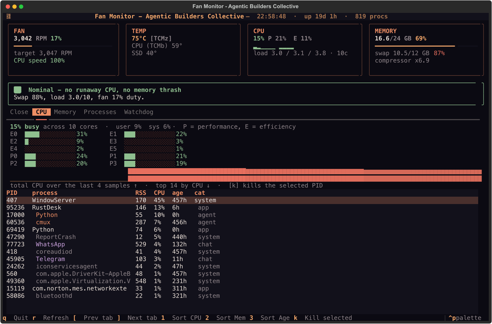
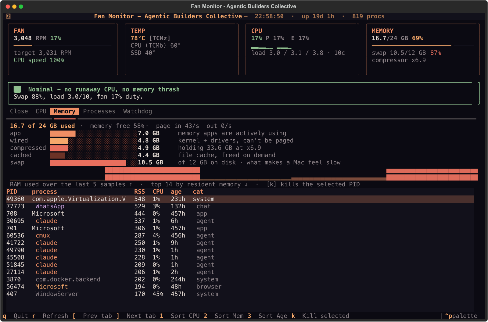

# User Guide

Everything `fm` shows you, and every key it responds to.

## Launch

```bash
fm                 # interactive TUI (default)
fm --interval 3    # refresh the live data every 3s (default 2.0)
fm --no-anim       # skip the animated ABC boot screen
fm --once          # print one snapshot frame and exit
```

## Screen anatomy

The TUI has four regions, top to bottom:

```
┌ Fan Monitor - Agentic Builders Collective · 23:30 · up 18d · 1126 procs ┐
├ Stats row ───────────────────────────────────────────────────────────────┤
│  FAN / COOLING       TEMP              CPU                 MEMORY        │
│  6,549 RPM 99%       96°C              40% P49 E34         20/24 GB      │
│  ████████████        CPU 89°           ▃▂▁▂ ▅▆▅▆           ████████      │
├ Verdict ────────────────────────────────────────────────────────────────┤
│  💾 Swap thrash — fan is spinning from memory pressure, not CPU          │
├ Tabs: [ Close ] [ CPU ] [ Memory ] [ Processes ] [ Watchdog ] ──────────┤
│  …the active tab's content…                                              │
└ Footer (key hints) ─────────────────────────────────────────────────────┘
```

Before this dashboard appears, the full sliced ABC wordmark assembles from rust
outlines into the peach → coral gradient while the first hardware readings load.
The boot screen stays up for at least three seconds, and longer when sampling is
still in progress. The completed mark holds long enough to read before the
persistent **Fan Monitor - Agentic Builders Collective** header takes over. Use
`--no-anim` or `FANMON_NO_ANIM=1` to skip the boot screen.

### The stats row

| Tile | Meaning |
|---|---|
| **FAN** | Actual fan RPM and % of its usable range (duty), the target RPM, and the CPU speed limit macOS is applying. |
| **COOLING** | Replaces FAN on a fanless machine (MacBook Air). Shows `passive · no fan`, the CPU speed limit from `pmset -g therm`, and how much macOS is throttling. `throttled 28%` is the Air's equivalent of a fan at full tilt. |
| **TEMP** | The hottest sensor `fm` can see, with the sensor key, plus two labelled readings (CPU, GPU, SSD…). Needs Stats.app. |
| **CPU** | Total busy % across all cores, the split between **P** (performance) and **E** (efficiency) cores, one block glyph per core (E cluster, gap, P cluster), and the 1 / 5 / 15-minute load. |
| **MEMORY** | RAM used of total with a bar, swap used / total and %, and the **memory-compressor ratio** (`x6.5` = how many GB of data are squeezed into 1 GB). |

Every bar and percentage uses the same three colours: **sage** (fine), **peach**
(warm), **coral** (hot) — the ABC gradient doubling as the heat scale.

### The Verdict

The most important line in the app. It names **why the machine is hot**:

| Verdict | Colour | What it means |
|---|---|---|
| 💾 **Swap thrash** | coral | Driven by memory pressure, *not* CPU. Close memory hogs. |
| 🔥 **CPU load** | peach/coral | Something is genuinely computing. The top contributor is named. |
| 🔀 **Memory + CPU** | coral | Both are heating the machine. |
| 🌡️ **CPU throttled** | peach/coral | No single hog, but macOS is holding the clock back. Residual heat; on an Air, passive cooling can't keep up. |
| 👀 **Fan elevated** | peach | Fan is up but no single clear cause — possibly residual heat from a recent burst. (Fan machines only.) |
| ✅ **Nominal** | sage | Everything looks fine; no runaway CPU, no thrash, no throttling. |

The persistent header is always **Fan Monitor - Agentic Builders Collective**;
the Verdict below uses hardware-aware language for fan and fanless Macs.

Full detail on how that verdict is computed lives in [How It Works](how-it-works.md)
and [The Algorithm](algorithm.md).

## Tabs

Move between tabs with `[` and `]`, or click them.

### Close — "what should I shut down?"

The recommendation list, **ranked for the currently active regime**.

- Rows are ranked by a score that weights RAM, CPU and age according to whether
  you're in a memory or CPU regime.
- Grouped rows (e.g. `claude@session-476111c5 x3`) are *batches* — killing one
  terminates every process in the group.
- The caption above the table reminds you what `k` does.
- **System daemons** that happen to be hot (like WindowServer) are listed as
  *advisories* above the table, never as kill targets.

### CPU — "which cores are pinned, and by what?"



- A summary line: total busy %, core count, user vs. system split.
- **One bar per core**, labelled `E0…` (efficiency) and `P0…` (performance) on
  Apple Silicon, `C0…` elsewhere. A pinned P-core is the usual reason a MacBook
  Air is warm.
- A **sparkline** of total CPU over the session (last 120 samples).
- The **top 14 processes by CPU**, using the real CPU-time delta, not the stale
  `ps %cpu` average. `k` works here.

### Memory — "where did my RAM go?"



- A summary line: used of total, macOS's own "memory free %", and page-in /
  page-out rates (sustained page-ins are the sound of swap thrash).
- A breakdown that matches Activity Monitor's vocabulary: **app**, **wired**,
  **compressed** (with how much it's holding and at what ratio), **cached
  files**, and **swap** on disk.
- A **sparkline** of RAM used over the session.
- The **top 14 processes by resident memory**. `k` works here.

### Processes — "what's actually using my Mac?"

One table of the top 80 processes, sorted by whichever metric you pick:

- `1` — sort by **CPU**
- `2` — sort by **memory** (RSS)
- `3` — sort by **age**

Columns: PID, process, RSS, CPU, age, category (the classification — `agent`,
`browser`, `chat`, `app`, `system`).

### Watchdog — "what has my own watchdog recorded?"

If you run the `dev.jensen.watchdog` service (or any watchdog that writes the
expected files), `fm` reads — never writes — its state: current probe status, the
configured trigger/re-arm RPM thresholds, and recent fan events. See
[Watchdog Integration](watchdog.md).

## Keys

| Key | Action | Notes |
|---|---|---|
| `q` | Quit | From anywhere. |
| `r` | Refresh now | Force an immediate re-sample. |
| `[` / `]` | Previous / next tab | Wraps around. |
| `1` / `2` / `3` | Sort Processes by CPU / memory / age | |
| `k` | **Kill the selected row** | Works in Close, CPU, Memory and Processes. Opens a confirmation prompt. |
| `y` / `n` | Confirm / cancel the kill | Only when the prompt is up. |
| `tab` | Move focus | Between the panes of the active tab. |

### Killing, safely

Pressing `k` on a row opens a prompt listing the exact PID(s):

```
┌ Terminate claude@session-476111c5 x3 ? ┐
│  SIGTERM → 3 process(es): 1234, 1235, 1236  │
│  [y] yes, terminate        [n] no           │
└───────────────────────────────────────────┘
```

Only after `y` does `fm` send `SIGTERM`, and it re-checks each PID is still alive
first. If a process already exited, `fm` reports it as "already gone." It never
sends `SIGKILL`.

!!! warning
    `fm` runs as your user, so it can only terminate processes you own. That's
    by design — it won't kill other users' or root's processes.

## Command-line flags

| Flag | Default | Meaning |
|---|---|---|
| `--interval <s>` | `2.0` | Live refresh interval. |
| `--once` | off | Print a single frame and exit. |
| `--warmup <s>` | `1.5` | For `--once`, the CPU-delta window before rendering. |
| `--no-anim` | off | Skip the animated ABC boot screen. |
| `--help` | | Show usage. |

## Environment variables

| Variable | Effect |
|---|---|
| `FANMON_FANLESS=1` | Pretend there is no fan (test the Air layout on any Mac). |
| `FANMON_THROTTLE=<0-100>` | Force the CPU speed limit reading, e.g. `72` = throttled 28%. |
| `FANMON_NO_ANIM=1` | Skip the animated ABC boot screen. |

Next: understand the reasoning behind the verdict in
[How It Works](how-it-works.md).
